## 0x01 Init

:::tip Note 
This is a repost of an old blog post I made on another site.
:::

Sometimes it's fun to turn the tables on the bad guys. A hobby of mine is hijacking botnets to see what all the fuss is about. The goal for today is to gain a shell on the malware host server.

:::danger
Don't actually do any of this. Someone once sent me threatening pictures of my children after I poked around the wrong botnet
:::

Anyway. C&C web panels are commonly included with malware, and act as a central dashboard providing statistics, command functionality, and access to stolen information such as passwords. As they are essentially the heart and brain of a malware campaign and can be used to control thousands of infected hosts they tend to be hidden on obscure domains, deep from the prying eyes of Google and other search indexers, making them difficult to discover. The panels themselves are usually secured with long and complicated passwords and sometimes require specific URL parameters to be present before access is granted.

They also tend to be poorly coded and subject to exploitation, which we will leverage to our advantage 😁. 

{/* truncate */}

First, we need to find an admin panel for an active botnet. This can be difficult, depending on your standards, and often is time consuming. Options including reverse-engineering malware found in the wild, using a malware tracker, or social engineering someone on one of the underground forums. Because I'm lazy I chose the second option, **using a malware tracker**, which conveniently provides the C&C url directly. The downside is the link most likely will not last long now as it has been marked as a malware host. Most serious threat actors will migrate to a new domain at the first whiff of public detection.

Here's an example of a malware tracker: 

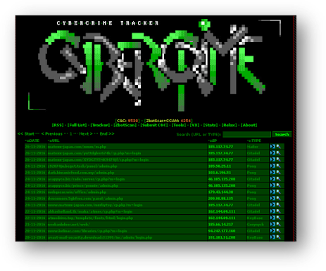

## 0x02 Reconnaissance

Looking at some recent URLs we see a domain hosting both KeyBase and Pony, making this ideal for reasons discussed shortly. Serious players almost never use a single host for multiple C&C panels, meaning the owner or owners are most likely new to the scene and inexperienced. This is good for us as it increases our chances at finding a bug or mistake to exploit.

As detailed by Paolo Stagno at [VoidSec](https://voidsec.com/keybase-en/), the panel for KeyBase is rather poorly coded and has a couple of major vulnerabilities, *including* **SQL injection**.  Here's the vulnerable bit of code, located in file `post.php`

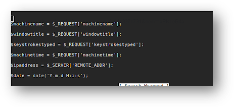

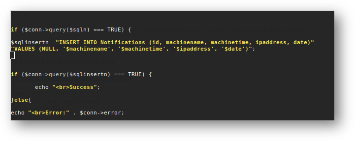

Notice the utter lack of input validation - escaping the query and appending our own code at` $machinename` in is what allows us to hijack this server.

Using `sqlmap` we can view the databases available to the mysql user. We also learn that the backend is Windows, and that we have db-admin privileges. We also can tell from the table names of the current db that a **Zeus** or **Citadel** panel is lurking somewhere on the server.

According to VoldSec the KeyBase application also has a file upload vulnerability. Unfortunately I was unable to get this to work, leaving us to find another way to access the backend system.

Now, due to design flaw or some other unknown reason, the creators of the **Pony** malware loader store the login credentials for the panel to the database itself...in plain text. Let's take a look:

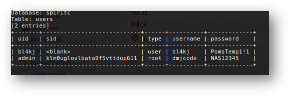

Now we have the admin credentials for one of the panels present on the server: `dmjcode/NAS12345`

The panel itself is pretty bare of activity. Looking at the stats we learn that only a handful of machines have been infected by the malware:

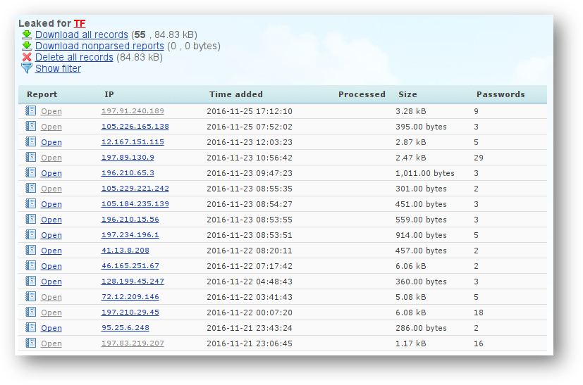

Nothing interesting here. Going back to `sqlmap` for inspiration I found that I overlooked something previously - the presence of a **phpmyadmin** installation. We know the current mysql user from our earlier sqlmap. Maybe they reuse passwords?

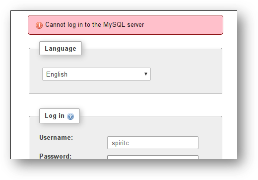

Back to sqlmap yet again. Because we are running on Windows (and thus have fewer permission issues), we can try and **read and writing to the backend system directly** with the `os-shell`, `file-read`, and` file-write` options.

Trying the `os-shell` and `file-write` features fails almost instantly. After some investigation I learned that this was not due to permission errors but due to how sqlmap attempts to write the files to the remote server.  

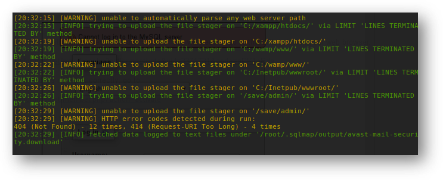

Luckily, the `file-read` feature *does* work. By correctly guessing the location of the Pony `config.php` file we can pull it with sqlmap. Let's take a look:

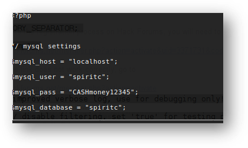

Now we have the actual mysql credentials and are getting somewhere. We can use the mysql username and password to login to phpmyadmin. 

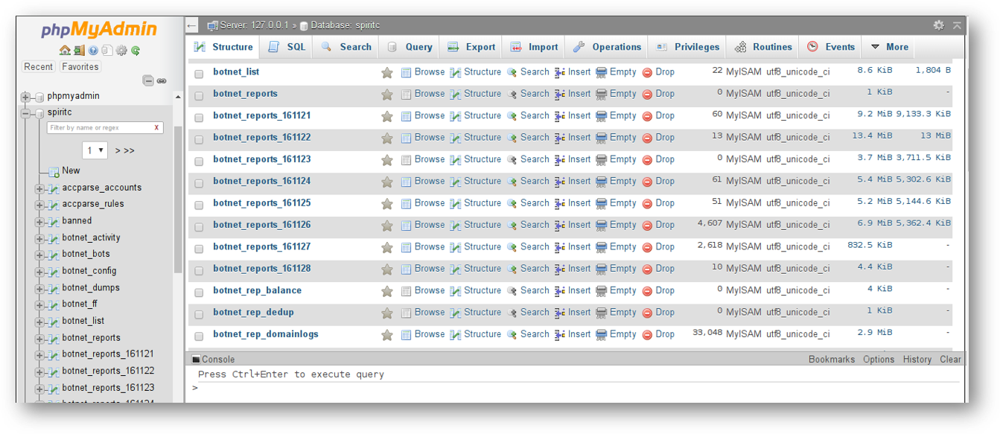

## 0x03 Exploitation 

Using phpmyadmin, let's add a single 1-line backdoor:

Using the `MySQL SELECT into outfile` command, we can write to the local file system. Because this is Windows, we have permission to write to the local `htdocs` folder:

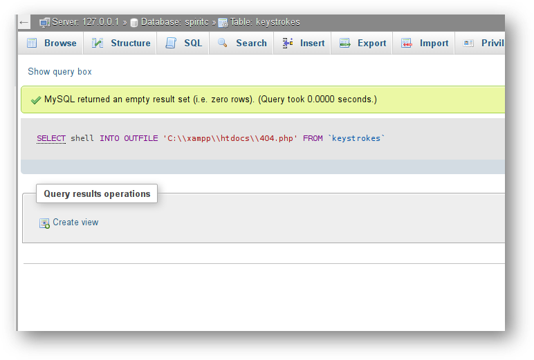

Now we have a backdoor to the local windows machine:

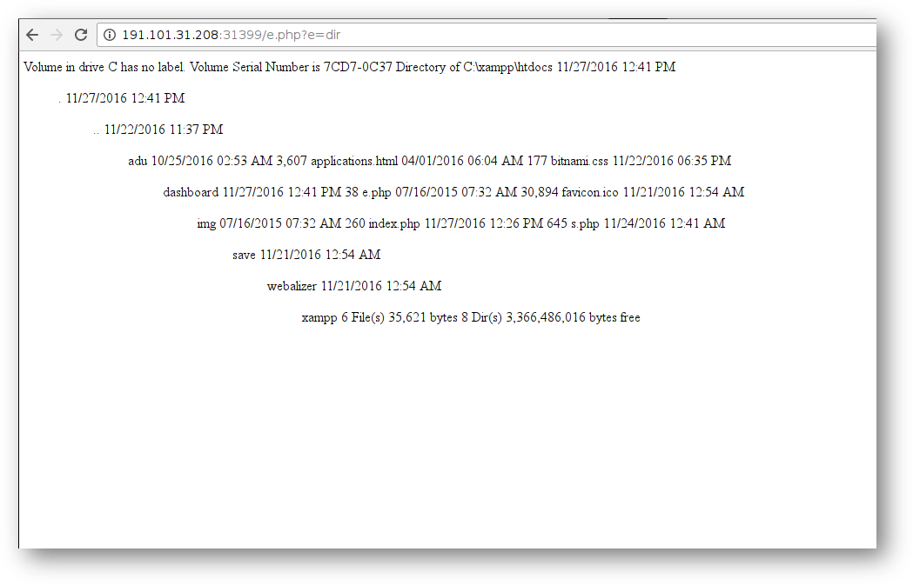

Using a combination of local files and executing my own SQL statements, I was able to find the **Zeus** panel and log myself in. The password was the same used on the Pony panel - don't reuse passwords! Even fraudster make this mistake.

Zeus panel. Not sure which variant this is for: 

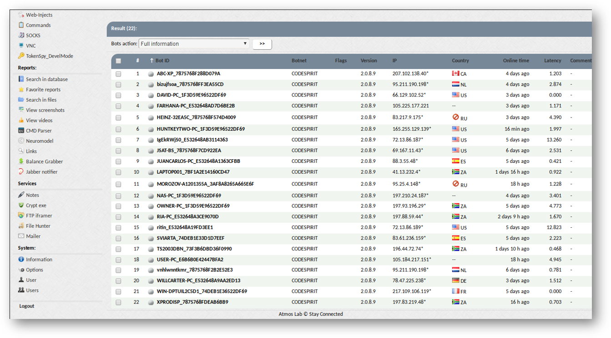

Poking around on the Zeus panel, it seemed some of the bots were pushing a version of the **Cryptolocker ransomware**. Unfortunately I was not able to penetrate the host that controlled this software. The good news is that they were using a version of cryptolocker-type malware that Kaspersky has a tool to decrypt files.

Also on host were CC tracks and full card info for online and in-store fraudulent purchases: 

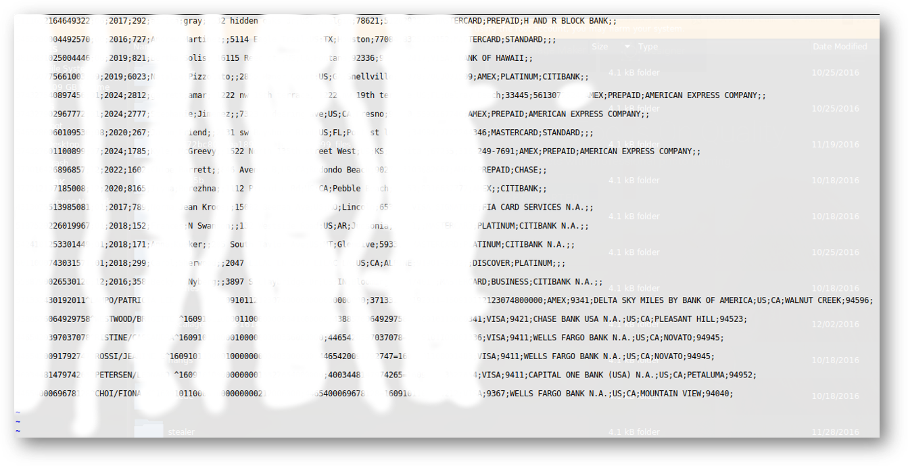

## 0x04 Conclusion 

The owners of the malware caught on at this point and took everything offline. Unfortunately for them, all the bots not yet suffering from Cryptolocker were deleted by me first 🤭.

