import Image from '@theme/IdealImage';

:::note File Information
File name: `com.bigos.androdumpper.apk` <br/>
Size: 11MiB <br/>
Type: android <br/>
Mime: application/zip <br/>
SHA256: d2490fc5fc5a5f6fd9f58a8e3c488601367638d4dd9f3a5f892131dc50df9031 <br/>
Last VirusTotal Scan: [11/17/2023 23:23:14](https://www.virustotal.com/file/d2490fc5fc5a5f6fd9f58a8e3c488601367638d4dd9f3a5f892131dc50df9031/analysis) <br/>
Last Sandbox Report: [11/17/2023 23:23:13](https://www.hybrid-analysis.com/sample/d2490fc5fc5a5f6fd9f58a8e3c488601367638d4dd9f3a5f892131dc50df9031/6557f5e04029ab79350e64d3) <br/>
Malware Family: Luminati (not currently classified as malware)
:::


## 0x1 Intro

Not all malicious (or at least dishonest) code can rightfully be called malware, even if the tactics used by the software in question are similar or even undistinguishable from actual malware. The difference is in how they are used. And sometimes - as in this case - you can grant developers permission to turn your Android device into a hidden SOCKS proxy for paying customers.

One of my favorite methods of poking around on Android devices is to install a [Linux chroot image](https://xdaforums.com/t/tutorial-how-to-build-ur-own-chrooted-linux-for-android-step-by-step.3586319/) on a *rooted* device so that I can make use of my favorite command-line tools. This gives me access to a full Linux distro on my device.  

I recently discovered an Android app called **AndroDumpper** that seemed innocent enough. However, when first starting the application you see this message asking you to agree to sharing some of your device's wifi and cellular data:


import androterms from './img/androterms.png';

<Image img={androterms} style={{height:500}} />


{/* truncate */}


So what does this mean? Well, after starting the application I can see a new p2p network interface as well as some system commands configuring it:

import ifconfig from './img/ifconfig.png';

<Image img={ifconfig} style={{height:500}} />


import ps from './img/ps.png';

<Image img={ps} style={{width:800}} />


The application appears to be tunneling network traffic through the new `tun0` interface, and if we open a network sniffer such as **Packet Capture** we can see that there is quite a bit of network traffic being used: 

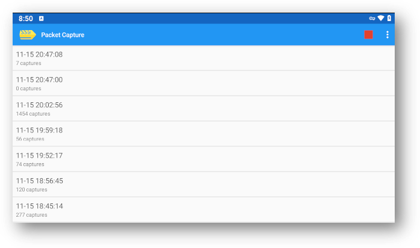

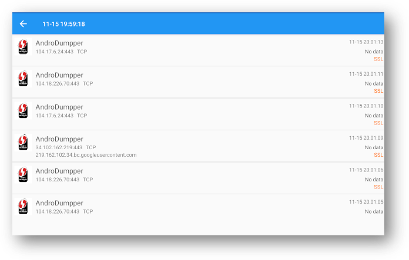

While all this network activity is happening, this is all I see from the application itself: 

import appmenu from './img/appmenu.png';

<Image img={appmenu} style={{height:500}} />


Unfortunately, the application is using [certificate pinning](https://developer.android.com/privacy-and-security/security-config) which makes it difficult to actually inspect the network packets. So far my attempts using Frida to bypass certificate pinning have failed for this application. In the past I was able to load a modified Xposed Framework module - if I can get this working I will update this post.  

Seeing as a live inspection of the application is impossible, let's take a look at the APK itself. 

## 0x2 Decompiled Library

First, I used **apktool** to decompile the APK. 

```shell 
apktool d androdummper-3-11.apk
```

My attention was immediately drawn to the libs folder containing five *shared object library* `.so` files. One in particular - `libtopvpn_svc-1.121.410.so` - caught my eye as it was pretty large.

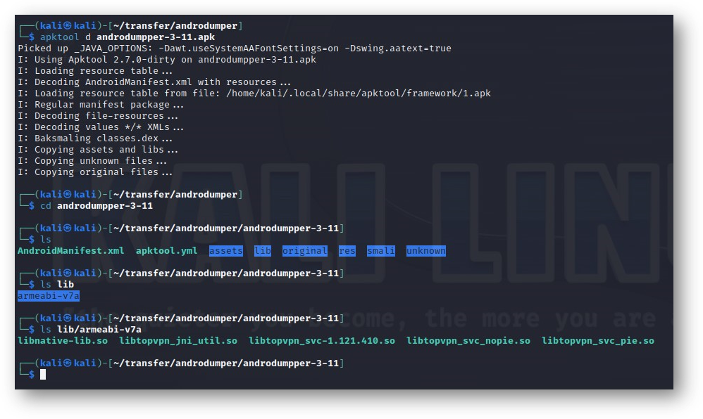

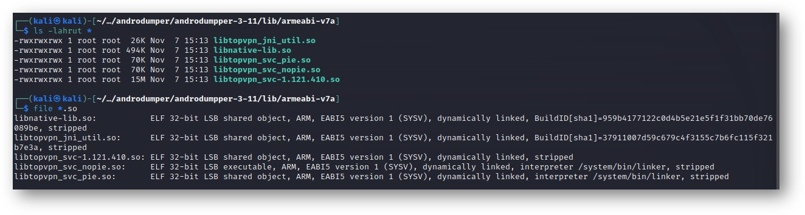

Unfortunately. the file was [stripped](https://www.man7.org/linux/man-pages/man1/strip.1.html) of all its symbols, making it very difficult to study. Not to be deterred, I searched for a couple of hours and eventually found an earlier file version intact, `libtopvpn_svc-1.66.306`.

Loading the non-stripped file in Ghidra revealed *hundreds* of functions. Here is the `main` function, edited a bit to repair the function signature:

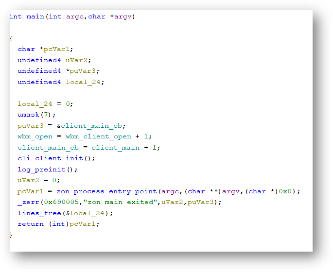

The sheer number of functions to sort through was quite overwhelming. Because the `main` function contained a string reference to the word **zon**, that's a good starting point. 

`zon_` functions: 

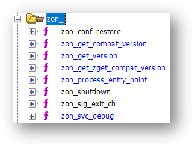

The function `zon_process_entry_point` function was interesting as it contained a reference to a javascript file and appeared to have command-line flags defined as arguments: 

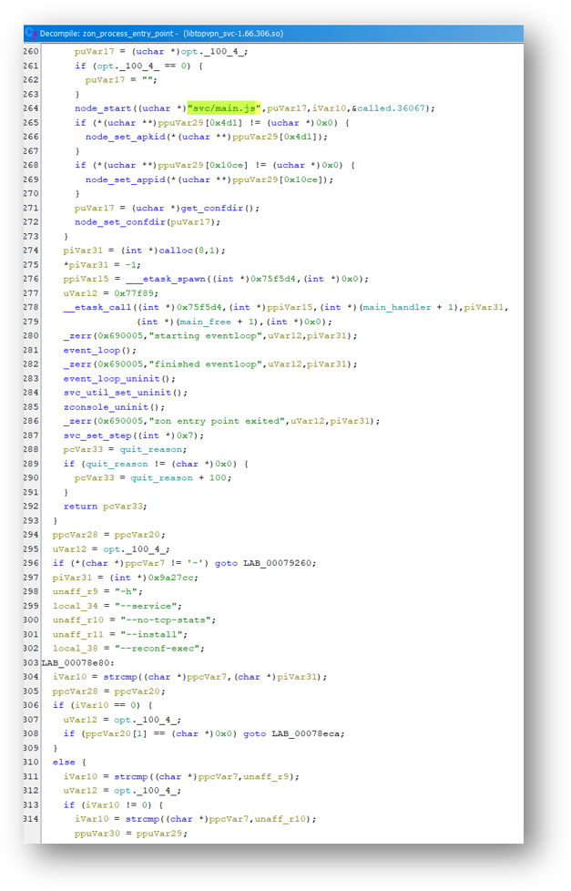

Lots of defined strings for `.js:

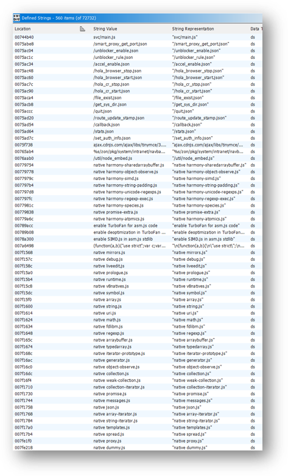` 

Also exciting is the reference to `hola_browser`. Hola VPN is a popular free VPN. What a lot of people need to learn about them is that they turn your device into a proxy connection point for their paying customers. More on that later. 

Digging through the functions some more, we can see that the process queries a database and inserts a list of hosts and IP addresses:

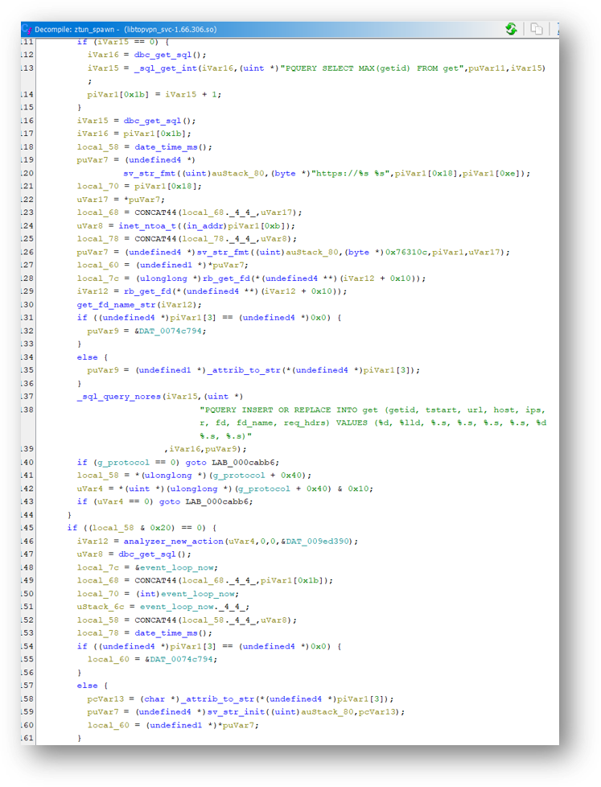

And here it appears to save a list of peers:

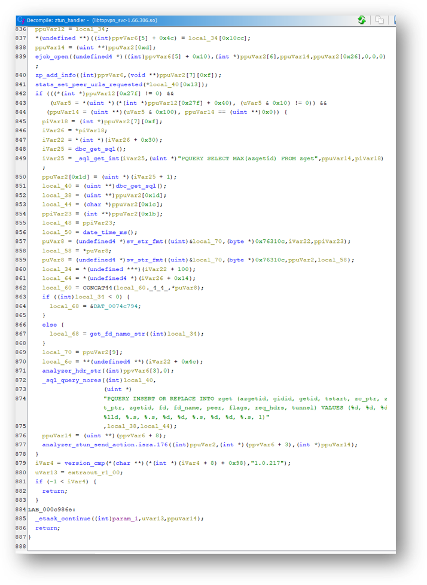

Function to execute the native android shell `/system/bin/sh`: 

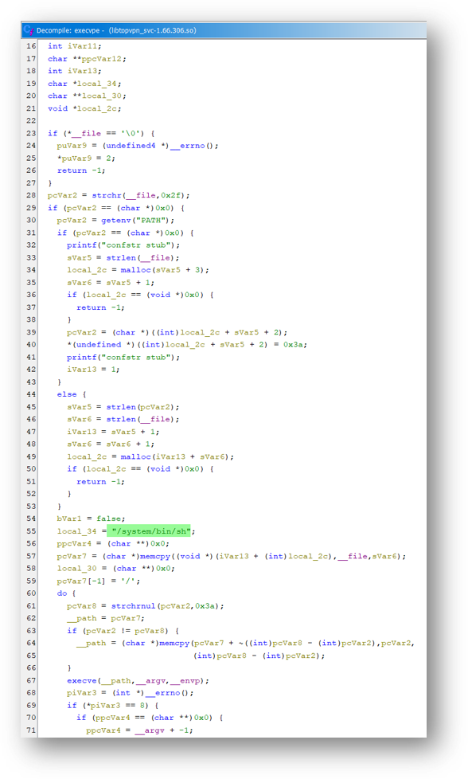

## 0x3 Extracted Framework

When first examining the `.so` in Ghidra, I initially assumed that the running code downloaded the javascript framework referenced in the source and saved it on the Android device somewhere. After a few hours of digging through functions, it became clear that the framework was packed into the file in some method. 

Running the `strings` command on both the original stripped library file (`libtopvpn_svc-1.121.410.so`) and the unstripped version (`libtopvpn_svc-1.66.306`) showed lots of readable text, including references to `.js` files. 

I tried using `binwalk` to see what might be extractable. To make things interesting, I focused on the unstripped file I extracted from the AndroDumpper APK. 

```shell 
binwalk -e libtopvpn_svc-1.121.410.so
```

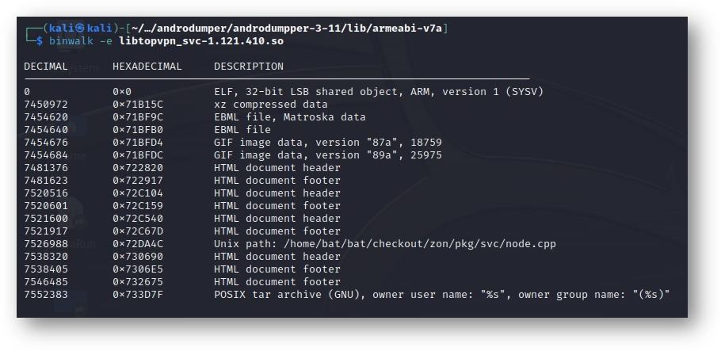

The results were immediate. As I suspected, this `.so` contains several javascript files cleverly packed into a shared object library, something I'd never encountered before. 

Some of the extracted files: 

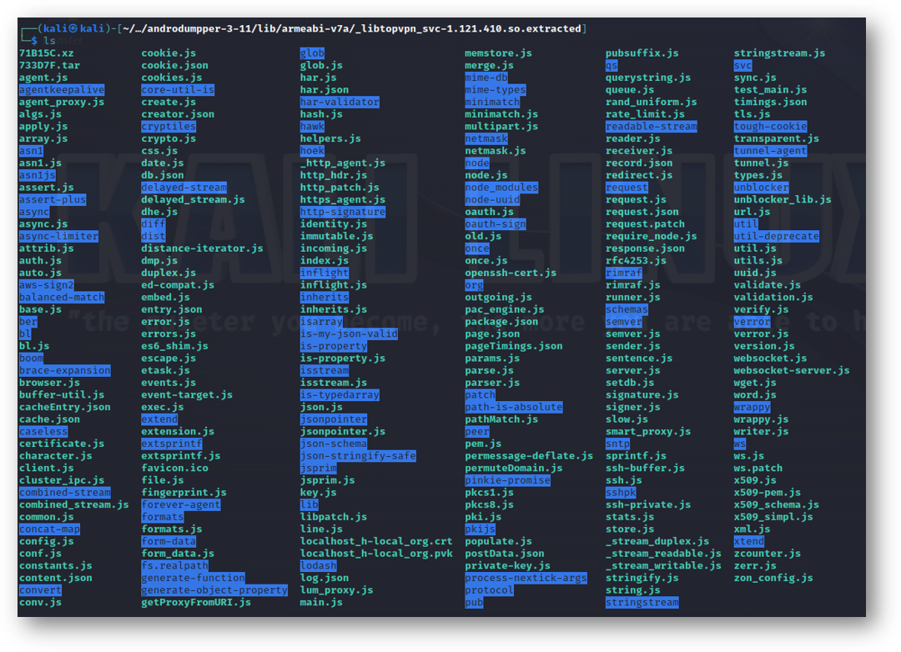

Here's a peek inside `lum_proxy.js`: 

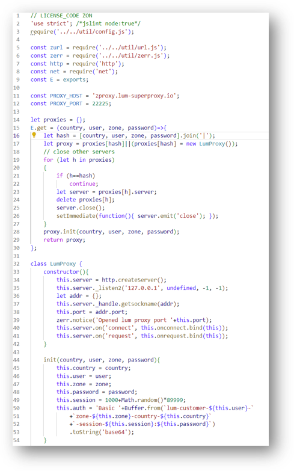

Some interesting `powershell` functions in `main.js`: 

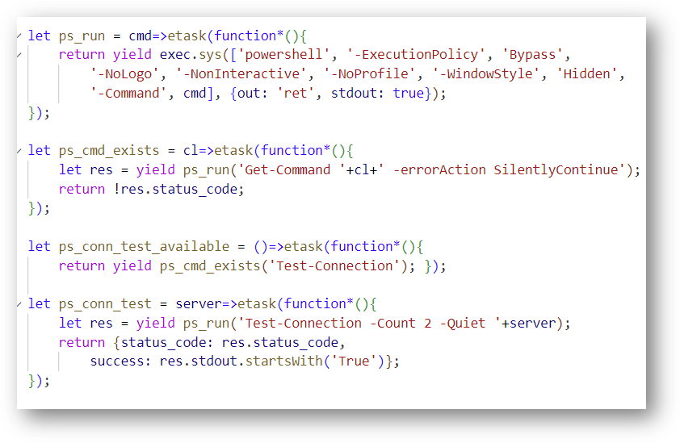

Configuration details in  `zon_config.js`: 

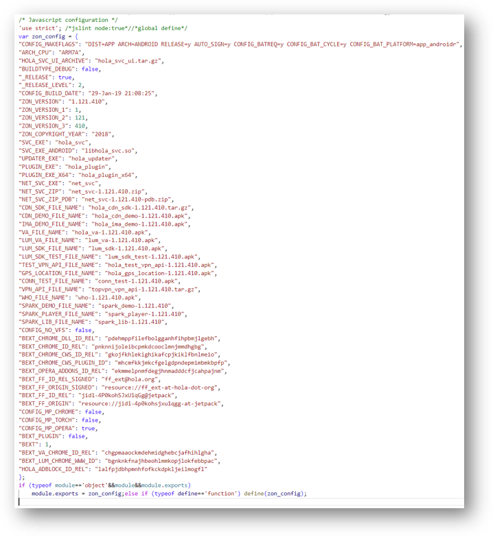

## 0x4 Conclusion

So what is all this? The solution came from `zon_config.js`, the standard client config file used by the [Bright Data](https://brightdata.com/luminati) proxy network - formerly known as **Luminati Networks**. Remember when I mentioned the **Hola VPN** turned your device into a proxy connection point for paying customers? Bright Data, a.k .a. Luminati, is the sister company of Hola VPN that sells those proxies.   

A lot has been written about this company before. Still, using the free Hola VPN app or browser extension allows your machine to be part of a SOCKS proxy botnet for paying Luminati customers. I first learned about Luminati by lurking on Russian crime forums, where it was mentioned as a popular tool for helping commit credit card fraud.  

The vast Bright Data SOCKS proxy network allows people (including criminals) to connect to a site using a home or mobile IP address from their chosen city. Fraudsters can bypass security measures this way when using stolen credit card info. Attempting to purchase an expensive item or service with a marked VPN or Russian IP would cause the purchase to be flagged. However, connecting via a Comcast or Verizon IP from the correct city will make the transaction seem much more legitimate. That's not to say that the service can't be used legitimately - I'm sure it can - but my exposure to it has left me with a poor opinion of the company and its tactics. 

However, the reason why the AndroDumpper application was bundling a proxy network disguised as a harmless shared object library remained.  

Well, it turns out that Bright Data offers a [monetization service](https://bright-sdk.com/) to app developers. Rather than including ads (as is typical in free apps), Bright Data offers to turn your application into a node for its network. They were very creative on their part but backhanded and sneaky. After all, **nowhere** in the agreement clause you see when first running the app does it implicity state you are effectively turning your device into a proxy server for Bright Data's paying customers.

It might be a stretch to call this behavior *malware*, but it raises some ethical considerations. 

Luckily, AndroDumpper *does* allow you to opt out of Luminati from the **Settings** menu, though they fail to mention why you might want to do this - in fact, this is the first time a user actually sees the name **Luminati** mentioned. 

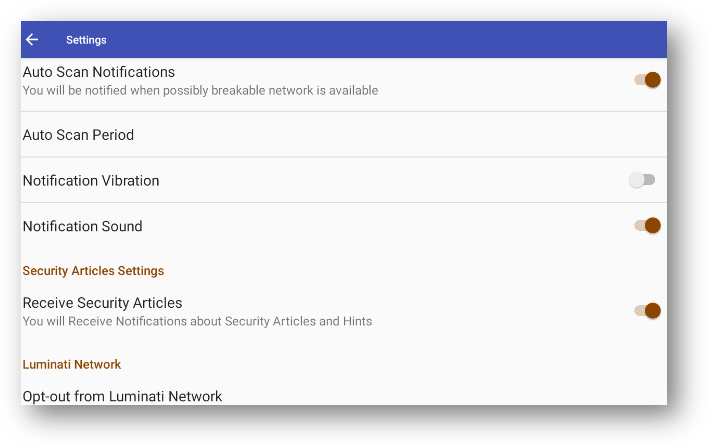

I'm still in the process of reversing this application, and plan to update this post once I do. 

All the files can be found on my [github](https://github.com/tohitsugu/androdumpper) if you want to take a peek yourself. **Note**: I had to compress the files into a `.7z` archive as they were too large to upload by otherwise. 


