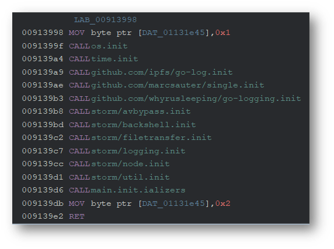
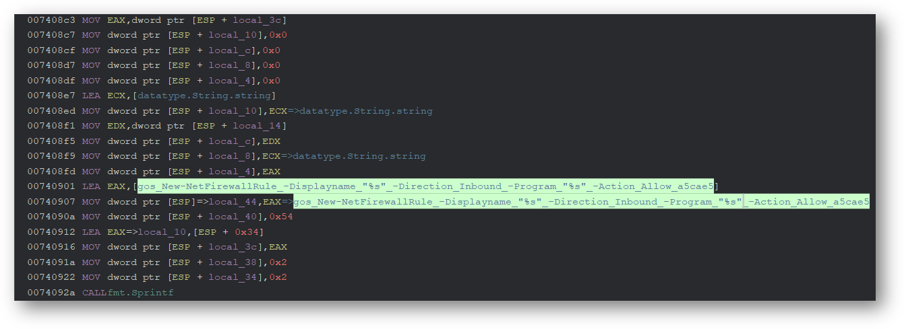
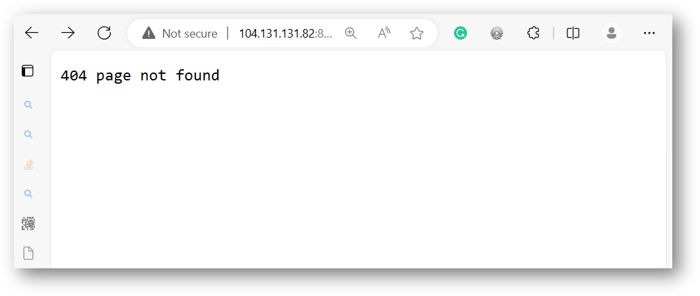
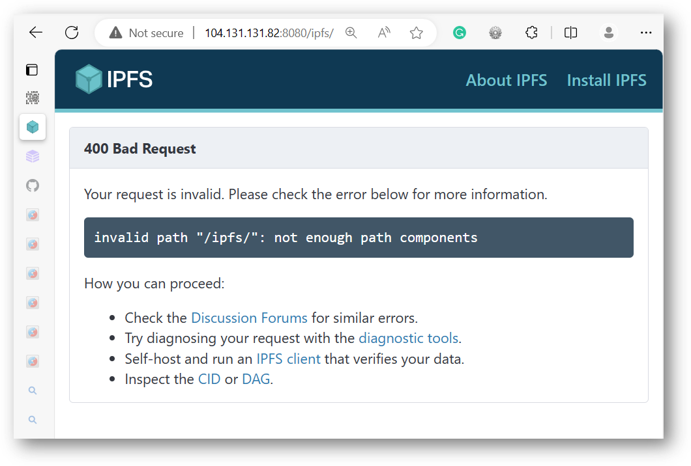
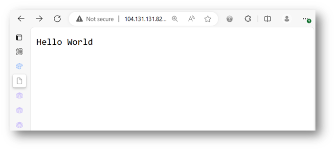
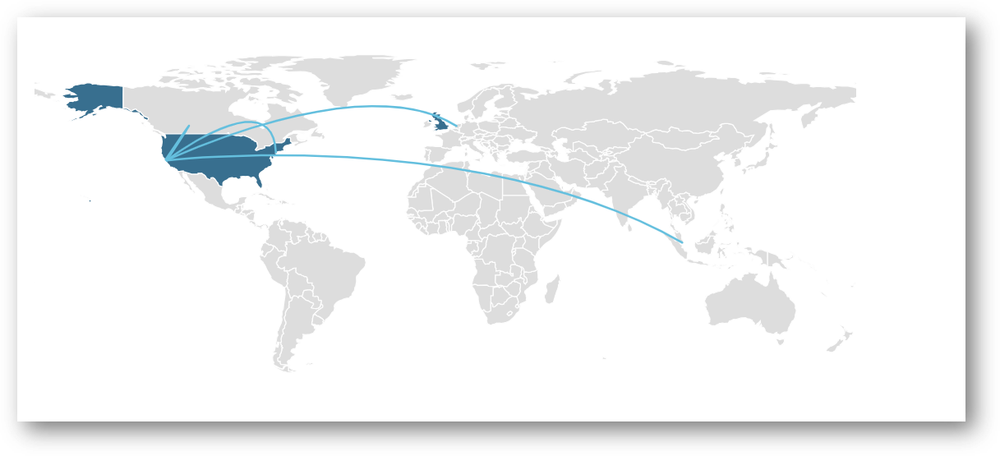

import Image from '@theme/IdealImage';

:::note File Information
File name: `6558073e997da5ca440b5a4b.exe` <br/>
Size: 13 MB <br/>
Type: PE Windows Executable <br/>
Mime: application/x-dosexec <br/>
SHA256: 7f731d2502dd39cbc16193ca7e9d147fe158c10236e00c634bb0680e2bfc4bfa 
<br/>Last VirusTotal Scan: [11/18/2023 00:20:37](https://www.virustotal.com/file/7f731d2502dd39cbc16193ca7e9d147fe158c10236e00c634bb0680e2bfc4bfa/analysis) <br/>
Last Sandbox Report: [11/18/2023 00:22:13](https://www.hybrid-analysis.com/sample/7f731d2502dd39cbc16193ca7e9d147fe158c10236e00c634bb0680e2bfc4bfa/6558073e997da5ca440b5a4b) <br/>
Malware Family: IPStorm 
Label: [Trojan:Win32/Fsysna](https://www.microsoft.com/en-us/wdsi/threats/malware-encyclopedia-description?Name=Trojan:Win32/Fsysna)
:::


{/* truncate */}

## 0x01 IPStorm  

:::tip Note 
This post is still a work in progress. I will update it as I make progress with this malware and will remove this comment when I am finished. 
:::


Earlier this week, several sites reported that the FBI [dismantled the IPStorm botnet](https://www.pcmag.com/news/fbi-shuts-down-ipstorm-malware-that-targeted-windows-mac-linux). The botnet was shut down on Tuesday, and Sergei Makinin has pleaded guilty to developing and deploying it.    

What interested me about this article was learning that IPStorm was written in Go, allowing it to easily be compiled for different operating systems. Many sites have already written about the [Linux variant](https://intezer.com/blog/research/a-storm-is-brewing-ipstorm-now-has-linux-malware/) of the malware, so I thought I'd take a look at a *Windows* sample.  

The file details are listed above. All the Windows samples I could find were quite large for malware, over 13 MB. This will make analysis more difficult as the disassembled and decompiled code file will be full of spaghetti code. 

## 0x02 Static Anaylsis 

Go files, in general, are usually difficult to analyze as they are statically built and stripped. This results in very large files with hundreds or thousands of unlabeled functions. This sample was no different. Loading the sample in Ghidra revealed nothing but functions labeled as `FUN_00XXXX`, the default format Ghidra uses with unknown functions. 

I installed the [GolangAnalyzerExtension](https://github.com/mooncat-greenpy/Ghidra_GolangAnalyzerExtension) plugin to make analysis more manageable. This renamed all the random `FUN_00XXXX` functions to their proper names. 

After loading the plugin, we can see the source path used by the malware author. The main file was saved at `/Users/brokleg/go/src/storm/storm.go` - here we can see why the malware was dubbed `IPStorm`, a combination of **ipfs** and **storm**. 

### Main Function 

IPStorm implements its main logic in a package helpfully called `main`. 

import main from './img/ipstorm/main.png';

<Image img={main}  alt="storm symbol tree" style={{width:600}} />

Upon execution, the `main.main` function starts its logging capability. It then begins calling functions from the `storm` package to bypass antivirus, set up file transfer, collect system runtime information, and add a new firewall rule using Powershell. The function also calls the `single` package to ensure that no other IPStorm processes are running. 


Looking at function `main.init`, we can see a list of the packages called. 



The main package of the malware is helpfully labeled as `storm`: 

import tree from './img/ipstorm/symboltree.png';

<Image img={tree}  alt="storm symbol tree" style={{width:400}} />

### Antivirus Evasion 

The Windows variant contains several functions to bypass any antivirus engines running on the host. 

import avbypass from './img/ipstorm/avbypass.png';

<Image img={avbypass}  alt="storm symbol tree" style={{width:600}} />

The malware makes several passes at evasion. In each pass, it calls the `util.RandomInt` and `time.Sleep` functions to pause for a random amount of time. 

import avhop from './img/ipstorm/avhop.png';

<Image img={avhop}  alt="storm symbol tree" style={{width:600}} />


### Installation and Persistence 

The `storm/util` package is responsible for installing the malware and gaining a persistent foothold on the host OS. The malware uses several functions to achieve this goal.

import util from './img/ipstorm/util.png';

<Image img={util}  alt="storm util" style={{width:400}} />

The util package contains code to generate random folder and file names. It also references `Microsoft.AAD.BrokerPlugin`, which is part of Microsoft OneDrive.  

import appdata from './img/ipstorm/appdata.png';

<Image img={appdata}  alt="appdata" style={{width:700}} />


The malware then uses Powershell to access the Windows registry. The code contains logic to access registry keys at `HKCU:\Software\Microsoft\FixDrive\Registration` and  `HKCU:\Software\Microsoft\Windows\CurrentVersion\Run`. The `CurrentVersion\Run` key is used by programs to ensure that their executable starts every time the user logs in to Windows.  

import registry from './img/ipstorm/registry.png';

<Image img={registry}  alt="storm symbol tree" style={{width:1000}} />

It later confirms it has been added to the registry keys by calling the  `storm.util.IsPersisted` function. 

import registrycontains from './img/ipstorm/registrycontains.png';

<Image img={registrycontains}  alt="registry contains" style={{width:700}} />

Using Powershell, it creates a new **firewall rule** for itself to ensure it can communicate with its C2. 




### Powershell Feature 

The Windows version of IPStorm uses **Powershell** to perform various tasks, including creating a **reverse shell**. 

import powershell from './img/ipstorm/powershell.png';

<Image img={powershell}  alt="storm symbol tree" style={{width:600}} />


### Reverse Shell 

The `backshell` package uses Powershell to create a reverse shell on the system.  

import backshell from './img/ipstorm/backshell.png';

<Image img={backshell}  alt="backshell symbol tree" style={{width:700}} />

import backshellinit from './img/ipstorm/backshell.init.png';

<Image img={backshellinit}  alt="backshell.init" style={{width:450}} /> 

The reverse shell capability is the main threat posed by this malware, allowing the attacker to execute system commands on the infected system.  


### Other Interesting Functions 

The malware checks if it is running in [Wine](https://www.winehq.org/), a compatibility layer that lets users run Windows programs on Linux.

import initwine from './img/ipstorm/initwine.png';

<Image img={initwine}  alt="storm symbol tree" style={{width:600}} />


## 0x03 Dynamic Analysis 

### Execution 

To simplify the analysis, I renamed my malware sample `ipstorm.exe`. After running [VMWare Cloak](https://github.com/d4rksystem/VMwareCloak), I took a snapshot and detonated the malware. Immediately upon execution, the process creates a lock file at `C:\<USER>\AppData\Local\Temp\n3R1PYfY.lock`. 

import procmonstart from './img/ipstorm/procmonstart.png';

<Image img={procmonstart}  alt="process start" style={{width:600}} />

import temp2 from './img/ipstorm/temp2.png';

<Image img={temp2}  alt="dropped file" style={{width:600}} />

If the malware is started with elevated privileges, it drops the file at `C:\Windows\Temp\n3R1PYfY.lock`. 

import temp from './img/ipstorm/temp.png';

<Image img={temp}  alt="dropped file elevated" style={{width:600}} />

The process then launches `cmd.exe`, which launches `powershell.exe -NoExit -Command -`. Using Powershell, IPStorm creates a firewall rule and writes data to a file named `StartupProfileData-Interactve`. 

import procmonprofile from './img/ipstorm/procmonprofile.png';

<Image img={procmonprofile}  alt="dropped file elevated" style={{width:600}} />

The malware opens several TCP sockets and communicates with several hosts. 

import procmonnetwork from './img/ipstorm/procmonnetwork.png';

<Image img={procmonnetwork}  alt="dropped file elevated" style={{width:600}} />


### Network Calls 

The sample attempts to connect to several different IPs and domains. Examining the strings in the process memory can give us more insight into what network activity is happening. 

import ipfsdomains from './img/ipstorm/ipfsdomains.png';

<Image img={ipfsdomains}  alt="dropped file elevated" style={{width:600}} />

We can see some of the IPFS requests being made as well:

import ipfsstrings from './img/ipstorm/ipfsstrings.png';

<Image img={ipfsstrings}  alt="dropped file elevated" style={{width:600}} />


I've resolved a few of the domains to their IPs below:   


- `104.131.131.82:4001 (mars.i.ipfs.io)` **Possible C2** 
- `178.62.158.247:4001 `
- `128.199.219.111:4001` 
- `104.236.76.40:4001`
- `104.236.179.241:4001` 
- `_dnsaddr.sv15.bootstrap.libp2p.io (139.178.91.71)`


All hosts except `104.131.131.82` and `139.178.91.71` are down. We can see some preliminary evidence that an IPFS service is running on at least one of the hosts: 


```shell 
sudo nmap -sV 104.131.131.82  -p 8080,4001

Starting Nmap 7.94 ( https://nmap.org ) at 2023-11-18 08:49 PST
Nmap scan report for mars.i.ipfs.io (104.131.131.82)
Host is up (0.020s latency).

PORT     STATE SERVICE            VERSION
4001/tcp open  libp2p-multistream libp2p multistream protocol 1.0.0
8080/tcp open  http               Golang net/http server (Go-IPFS json-rpc or InfluxDB API)
```

Trying to navigate to port `8080` in a browser gives a very non-descript 404: 





By playing with the URL path a bit, we can see a descriptive error message clearly showing IPFS:



Thus far, every sample of IPStorm I've looked at contacts this host and the one below (sv15.bootstrap.libp2p.io). 

This application needs an IPFS content identifier or **CID**. This can be a string or a file. IPFS encodes all content into a **base58** encoded hash called a **multihash**. As an example, we can have the application display back a message by navigating to `http://104.131.131.82:8080/ipfs/QmWATWQ7fVPP2EFGu71UkfnqhYXDYH566qy47CnJDgvs8u`: 





The last address - `_dnsaddr.bootstrap.libp2p.io` - is interesting as it appears to be using [multiaddr](https://multiformats.io/multiaddr/). Here is an excerpt from their [github](https://github.com/multiformats/multiaddr/blob/master/protocols/DNSADDR.md)

import dns from './img/ipstorm/dns.png';

<Image img={dns}  alt="multiaddr-dns" style={{width:"600%"}} />

Without multiaddr support, the domain is unreachable as-is, possibly another built-in defense mechanism to evade analysis in a sandbox. 


```shell 
nslookup _dnsaddr.sv15.bootstrap.libp2p.io
Server:         172.31.80.1
Address:        172.31.80.1#53

Non-authoritative answer:
*** Can't find _dnsaddr.sv15.bootstrap.libp2p.io: No answer
```

Removing the `_dnsaddr` gives a little more info: 

```shell 
nslookup sv15.bootstrap.libp2p.io
Server:         172.31.80.1
Address:        172.31.80.1#53

Non-authoritative answer:
Name:   sv15.bootstrap.libp2p.io
Address: 139.178.91.71
Name:   sv15.bootstrap.libp2p.io
Address: 2604:1380:45e3:6e00::1
```

Running a `whois 139.178.91.71` reveals that the IP is assigned to Equinix Services, a network provider and data center based in New York. 

Nmap reveals a little more information about the application running on port `4001`: 

```shell 
sudo nmap -sV  139.178.91.71 -p 443,4001
Starting Nmap 7.94 ( https://nmap.org ) at 2023-11-18 08:42 PST
Nmap scan report for sv15 (139.178.91.71)

Host is up (0.032s latency).

PORT     STATE SERVICE            VERSION
443/tcp  open  ssl/http           nginx 1.16.1
4001/tcp open  libp2p-multistream libp2p multistream protocol 1.0.0

Service detection performed. Please report any incorrect results at https://nmap.org/submit/ .
Nmap done: 1 IP address (1 host up) scanned in 19.68 seconds
```

```shell 
 nc -v  139.178.91.71 4001

Warning: forward host lookup failed for sv15: Unknown host
sv15 [139.178.91.71] 4001 (?) open

/multistream/1.0.0
```


The web server is a wrapper for the multistream service on port `4001`: 

```shell 
curl https://sv15.bootstrap.libp2p.io/

WebSocket protocol violation: Connection header "keep-alive" does not contain Upgrade
```

Using [websocat](https://github.com/vi/websocat), we can connect to the server using a websocket: 

```shell 
./websocat_max.x86_64-unknown-linux-musl  wss://sv15.bootstrap.libp2p.io//multistream/1.0.0

/multistream/1.0.0
```

#### Multistream Requests 

I captured and extracted the following multisteam DNS requests: 


| Request                           | Response                                                     |
| --------------------------------- | ------------------------------------------------------------ |
| _dnsaddr.bootstrap.libp2p.io      | dnsaddr=/dnsaddr/sv15.bootstrap.libp2p.io/p2p/QmNnooDu7bfjPFoTZYxMNLWUQJyrVwtbZg5gBMjTezGAJN |
| _dnsaddr.bootstrap.libp2p.io      | dnsaddr=/dnsaddr/sg1.bootstrap.libp2p.io/p2p/QmcZf59bWwK5XFi76CZX8cbJ4BhTzzA3gU1ZjYZcYW3dwt |
| _dnsaddr.bootstrap.libp2p.io      | dnsaddr=/dnsaddr/am6.bootstrap.libp2p.io/p2p/QmbLHAnMoJPWSCR5Zhtx6BHJX9KiKNN6tpvbUcqanj75Nb |
| _dnsaddr.bootstrap.libp2p.io      | dnsaddr=/dnsaddr/ny5.bootstrap.libp2p.io/p2p/QmQCU2EcMqAqQPR2i9bChDtGNJchTbq5TbXJJ16u19uLTa |
| _dnsaddr.sv15.bootstrap.libp2p.io | dnsaddr=/dns4/sv15.bootstrap.libp2p.io/tcp/443/wss/p2p/QmNnooDu7bfjPFoTZYxMNLWUQJyrVwtbZg5gBMjTezGAJN |
| _dnsaddr.sv15.bootstrap.libp2p.io | dnsaddr=/ip4/139.178.91.71/udp/4001/quic-v1/p2p/QmNnooDu7bfjPFoTZYxMNLWUQJyrVwtbZg5gBMjTezGAJN |
| _dnsaddr.sv15.bootstrap.libp2p.io | dnsaddr=/dns6/sv15.bootstrap.libp2p.io/tcp/443/wss/p2p/QmNnooDu7bfjPFoTZYxMNLWUQJyrVwtbZg5gBMjTezGAJN |
| _dnsaddr.sv15.bootstrap.libp2p.io | dnsaddr=/ip4/139.178.91.71/tcp/4001/p2p/QmNnooDu7bfjPFoTZYxMNLWUQJyrVwtbZg5gBMjTezGAJN |
| _dnsaddr.sv15.bootstrap.libp2p.io | dnsaddr=/ip6/2604:1380:45e3:6e00::1/udp/4001/quic-v1/p2p/QmNnooDu7bfjPFoTZYxMNLWUQJyrVwtbZg5gBMjTezGAJN |
| _dnsaddr.sv15.bootstrap.libp2p.io | dnsaddr=/ip6/2604:1380:45e3:6e00::1/udp/4001/quic/p2p/QmNnooDu7bfjPFoTZYxMNLWUQJyrVwtbZg5gBMjTezGAJN |
| _dnsaddr.sv15.bootstrap.libp2p.io | dnsaddr=/ip4/139.178.91.71/udp/4001/quic/p2p/QmNnooDu7bfjPFoTZYxMNLWUQJyrVwtbZg5gBMjTezGAJN |
| _dnsaddr.sv15.bootstrap.libp2p.io | dnsaddr=/ip6/2604:1380:45e3:6e00::1/tcp/4001/p2p/QmNnooDu7bfjPFoTZYxMNLWUQJyrVwtbZg5gBMjTezGAJN |
| _dnsaddr.ny5.bootstrap.libp2p.io  | dnsaddr=/dns6/ny5.bootstrap.libp2p.io/tcp/443/wss/p2p/QmQCU2EcMqAqQPR2i9bChDtGNJchTbq5TbXJJ16u19uLTa |
| _dnsaddr.ny5.bootstrap.libp2p.io  | dnsaddr=/ip4/136.144.51.25/udp/4001/quic-v1/p2p/QmQCU2EcMqAqQPR2i9bChDtGNJchTbq5TbXJJ16u19uLTa |
| _dnsaddr.ny5.bootstrap.libp2p.io  | dnsaddr=/ip4/136.144.51.25/tcp/4001/p2p/QmQCU2EcMqAqQPR2i9bChDtGNJchTbq5TbXJJ16u19uLTa |
| _dnsaddr.ny5.bootstrap.libp2p.io  | dnsaddr=/dns4/ny5.bootstrap.libp2p.io/tcp/443/wss/p2p/QmQCU2EcMqAqQPR2i9bChDtGNJchTbq5TbXJJ16u19uLTa |
| _dnsaddr.ny5.bootstrap.libp2p.io  | dnsaddr=/ip6/2604:1380:45d2:8100::1/udp/4001/quic-v1/p2p/QmQCU2EcMqAqQPR2i9bChDtGNJchTbq5TbXJJ16u19uLTa |
| _dnsaddr.ny5.bootstrap.libp2p.io  | dnsaddr=/ip6/2604:1380:45d2:8100::1/tcp/4001/p2p/QmQCU2EcMqAqQPR2i9bChDtGNJchTbq5TbXJJ16u19uLTa |
| _dnsaddr.ny5.bootstrap.libp2p.io  | dnsaddr=/ip4/139.178.65.157/udp/4001/quic/p2p/QmQCU2EcMqAqQPR2i9bChDtGNJchTbq5TbXJJ16u19uLTa |
| _dnsaddr.ny5.bootstrap.libp2p.io  | dnsaddr=/ip6/2604:1380:45d2:8100::1/udp/4001/quic/p2p/QmQCU2EcMqAqQPR2i9bChDtGNJchTbq5TbXJJ16u19uLTa |
| _dnsaddr.sg1.bootstrap.libp2p.io  | dnsaddr=/dns6/sg1.bootstrap.libp2p.io/tcp/443/wss/p2p/QmcZf59bWwK5XFi76CZX8cbJ4BhTzzA3gU1ZjYZcYW3dwt |
| _dnsaddr.sg1.bootstrap.libp2p.io  | dnsaddr=/ip4/145.40.118.135/udp/4001/quic-v1/p2p/QmcZf59bWwK5XFi76CZX8cbJ4BhTzzA3gU1ZjYZcYW3dwt |
| _dnsaddr.sg1.bootstrap.libp2p.io  | dnsaddr=/dns4/sg1.bootstrap.libp2p.io/tcp/443/wss/p2p/QmcZf59bWwK5XFi76CZX8cbJ4BhTzzA3gU1ZjYZcYW3dwt |
| _dnsaddr.sg1.bootstrap.libp2p.io  | dnsaddr=/ip4/145.40.118.135/tcp/4001/p2p/QmcZf59bWwK5XFi76CZX8cbJ4BhTzzA3gU1ZjYZcYW3dwt |
| _dnsaddr.sg1.bootstrap.libp2p.io  | dnsaddr=/ip6/2604:1380:40e1:9c00::1/udp/4001/quic/p2p/QmcZf59bWwK5XFi76CZX8cbJ4BhTzzA3gU1ZjYZcYW3dwt |
| _dnsaddr.sg1.bootstrap.libp2p.io  | dnsaddr=/ip6/2604:1380:40e1:9c00::1/tcp/4001/p2p/QmcZf59bWwK5XFi76CZX8cbJ4BhTzzA3gU1ZjYZcYW3dwt |
| _dnsaddr.sg1.bootstrap.libp2p.io  | dnsaddr=/ip6/2604:1380:40e1:9c00::1/udp/4001/quic-v1/p2p/QmcZf59bWwK5XFi76CZX8cbJ4BhTzzA3gU1ZjYZcYW3dwt |
| _dnsaddr.sg1.bootstrap.libp2p.io  | dnsaddr=/ip4/145.40.118.135/udp/4001/quic/p2p/QmcZf59bWwK5XFi76CZX8cbJ4BhTzzA3gU1ZjYZcYW3dwt |
| _dnsaddr.am6.bootstrap.libp2p.io  | dnsaddr=/ip4/147.75.87.27/tcp/4001/p2p/QmbLHAnMoJPWSCR5Zhtx6BHJX9KiKNN6tpvbUcqanj75Nb |
| _dnsaddr.am6.bootstrap.libp2p.io  | dnsaddr=/dns4/am6.bootstrap.libp2p.io/tcp/443/wss/p2p/QmbLHAnMoJPWSCR5Zhtx6BHJX9KiKNN6tpvbUcqanj75Nb |
| _dnsaddr.am6.bootstrap.libp2p.io  | dnsaddr=/dns6/am6.bootstrap.libp2p.io/tcp/443/wss/p2p/QmbLHAnMoJPWSCR5Zhtx6BHJX9KiKNN6tpvbUcqanj75Nb |
| _dnsaddr.am6.bootstrap.libp2p.io  | dnsaddr=/ip4/147.75.87.27/udp/4001/quic-v1/p2p/QmbLHAnMoJPWSCR5Zhtx6BHJX9KiKNN6tpvbUcqanj75Nb |
| _dnsaddr.am6.bootstrap.libp2p.io  | dnsaddr=/ip6/2604:1380:4602:5c00::3/udp/4001/quic/p2p/QmbLHAnMoJPWSCR5Zhtx6BHJX9KiKNN6tpvbUcqanj75Nb |
| _dnsaddr.am6.bootstrap.libp2p.io  | dnsaddr=/ip6/2604:1380:4602:5c00::3/udp/4001/quic-v1/p2p/QmbLHAnMoJPWSCR5Zhtx6BHJX9KiKNN6tpvbUcqanj75Nb |
| _dnsaddr.am6.bootstrap.libp2p.io  | dnsaddr=/ip6/2604:1380:4602:5c00::3/tcp/4001/p2p/QmbLHAnMoJPWSCR5Zhtx6BHJX9KiKNN6tpvbUcqanj75Nb |
| _dnsaddr.am6.bootstrap.libp2p.io  | dnsaddr=/ip4/147.75.87.27/udp/4001/quic/p2p/QmbLHAnMoJPWSCR5Zhtx6BHJX9KiKNN6tpvbUcqanj75Nb |


#### Contacted Countries 




